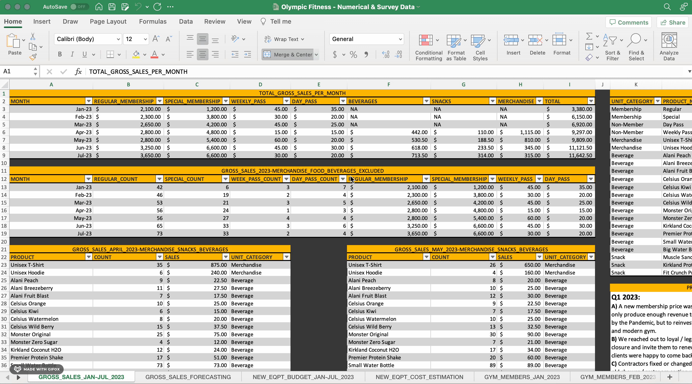

# Olympic Fitness Gym - Business Analysis

### Description
This project derives from the ongoing process of fully remodeling the Olympic Fitness, which is a medium-sized old school style gym or fitness center established in 1973. 
Business owners decided to perform full-scale remodeling and renovation of the establishment. The author of this presentation has been volunteering to multiple phases of the 
Olympic Fitness’ continuous project that was launched in January 2023. The next big milestone is to set up a CrossFit section in the establishment's back patio - this is expected to be completed on 2025.

<b>Click the following to open the presentation:</b> https://github.com/Juan-Moctezuma/Olympic_Fitness-Business_Analysis/blob/main/Olympic_Fitness-Business_Analysis.pdf   
<b>To download and see the numerical and survey results, click the following link:</b> https://github.com/Juan-Moctezuma/Olympic_Fitness-Business_Analysis/blob/main/Olympic%20Fitness%20-%20Numerical%20%26%20Survey%20Data.xlsx   
<b>Reference:</b> https://www.instagram.com/olympic.fitness.tj/

# This ongoing project’s business analysis involves the following: 
   * Understanding business objectives
   * Research surveys
   * Cost estimation & budgeting - for exercise equipment
   * Making data-driven decisions & recommendations
   * Strategic planning (short-term & long-term) & execution
   * Customer experience
   * Branding & logo selection

### Excel GIF

# What's included in the spreadsheet (per tab)?
   * Gross Sales - January 2023 to July 2023
   * Gross Sales - Forecasting
   * New Equipment Budget - January 2023 to July 2023
   * New Equipment Cost Estimation
   * Gym Members (tabs from January 2023 - July 2023)
   * Gym Churn Data
   * Logo Survey Participants & responses
   * Replacement Survey Participants & responses
   * New Equipment Survey Participants & responses
   * Customer Experience Participants & reponses

# Learning outcomes & experiences
   * Interpersonal skills and constant interaction
   * Creating and conducting research surveys
   * Decision-making experience and providing recommendations
   * Creating a budget and deciding what equipment needs to get purchased
   * Excel's linear forecast function for gross sales
   * Business acumen with emphasis on Gyms or Fitness Centers
   * Planning for growth

  
